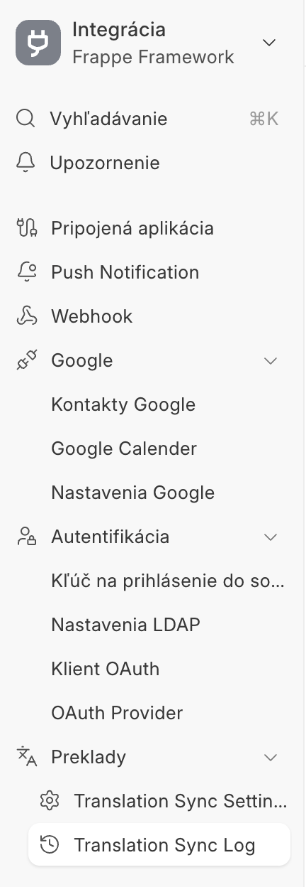
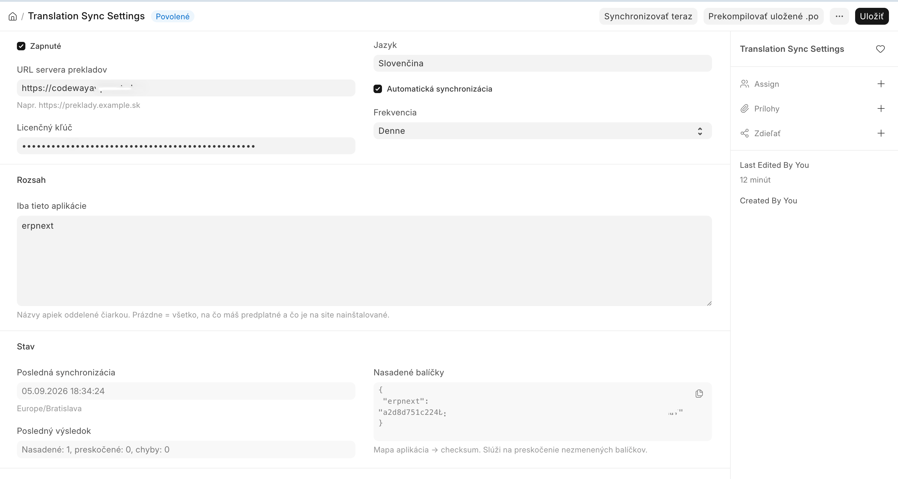
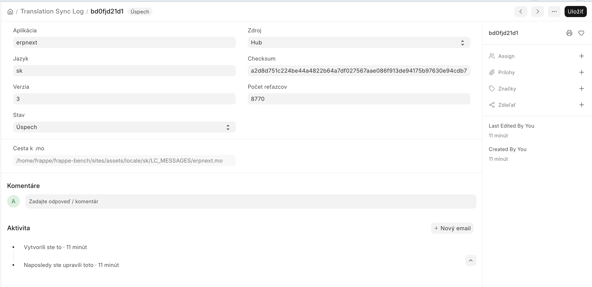

# SK Translations

Slovenské (a ďalšie jazykové) preklady pre Frappe / ERPNext v16, ktoré sa
nasadzujú automaticky — bez kopírovania súborov na server a bez spúšťania
`bench`.

Aplikácia sa v nastavenom intervale spojí s distribučným serverom prekladov,
stiahne aktuálne jazykové balíčky, skompiluje ich a preklad sa prejaví hneď po
obnovení stránky (F5). Netreba reštart, migráciu ani zásah do súborov servera.

Vyvinula firma **Code Way, s.r.o.** — [codeway.sk](https://codeway.sk) ·
[info@codeway.sk](mailto:info@codeway.sk)

## Požiadavky

- Frappe Framework / ERPNext **v16**
- Python 3.14+
- Prístup zo servera na internet (HTTPS na server prekladov)
- Rola **System Manager** na inštaláciu a nastavenie
- **Licenčný kľúč a URL servera prekladov** — poskytne Code Way, s.r.o.
  (napíšte na [info@codeway.sk](mailto:info@codeway.sk))

## Inštalácia

```bash
bench get-app sk_translations https://github.com/neofree75/erpnext-app-preklady.git
bench --site <vasa-site> install-app sk_translations
```

Po inštalácii sa v ľavom paneli workspace **Integrations** objaví sekcia
**Preklady** s dvoma položkami: *Translation Sync Settings* a
*Translation Sync Log*.



*Bočný panel workspace **Integrácia**. Sekcia **Preklady** je celý používateľský
vstup do aplikácie: **Translation Sync Settings** (nastavenie a ručné spustenie)
a **Translation Sync Log** (história nasadených balíčkov). Ak sekciu nevidíte,
obnovte stránku (F5).*

## Nastavenie

Otvorte **Translation Sync Settings** a vyplňte:

| Pole | Význam |
|---|---|
| **Zapnuté** | Hlavný vypínač aplikácie. |
| **URL servera prekladov** | Adresa, ktorú vám poskytla Code Way, s.r.o. |
| **Licenčný kľúč** | Kľúč, ktorý vám poskytla Code Way, s.r.o. |
| **Jazyk** | Jazyk prekladov, predvolene `sk`. |
| **Automatická synchronizácia** | Zapne pravidelné sťahovanie na pozadí. |
| **Frekvencia** | *Denne* alebo *Týždenne*. |
| **Iba tieto aplikácie** | Voliteľné. Zoznam aplikácií, ktoré sa majú prekladať; prázdne = všetky dostupné. |



*Obrazovka **Translation Sync Settings**. Hore vľavo je pripojenie na server
(URL a licenčný kľúč), vpravo jazyk a plán automatickej synchronizácie. Sekcia
**Rozsah** obmedzuje preklad na vybrané aplikácie (`erpnext` na obrázku), sekcia
**Stav** je len na čítanie — ukazuje čas poslednej synchronizácie, jej výsledok
(`Nasadené: 1, preskočené: 0, chyby: 0`) a mapu *aplikácia → checksum*, podľa
ktorej sa nezmenené balíčky preskakujú. Tlačidlá vpravo hore: **Synchronizovať
teraz** stiahne a nasadí balíčky, **Prekompilovať uložené .po** znovu zostaví
`.mo` súbory z už stiahnutých prekladov bez volania servera.*

Uložte a kliknite na **Synchronizovať teraz**. Sync beží na pozadí; po chvíli
sa v sekcii *Stav* doplní **Posledná synchronizácia** a **Posledný výsledok**.

Potom stránku obnovte (F5) a preklady sú nasadené. Ďalej to už beží samo podľa
nastavenej frekvencie.

## Overenie, že to funguje

V **Translation Sync Log** je jeden záznam na každý nasadený balíček:
aplikácia, jazyk, verzia, počet reťazcov a stav (*Úspech*, *Chyba*,
*Preskočené*). Pri chybe je v zázname aj jej popis.



*Detail záznamu v **Translation Sync Log**. **Aplikácia** a **Jazyk** hovoria,
čoho sa balíček týka, **Zdroj** odkiaľ prišiel (*Hub* = server prekladov),
**Verzia** a **Checksum** identifikujú konkrétny balíček, **Počet reťazcov** je
množstvo preložených textov (8770 v ukážke) a **Cesta k .mo** je skompilovaný
súbor, ktorý Frappe reálne používa. Stav **Úspech** v hlavičke znamená, že
balíček je nasadený.*

## Riešenie problémov

**Preklady sa nezmenili.** Obnovte stránku (F5) — prehliadač má staré reťazce
načítané. Ak to nepomôže, skontrolujte posledný záznam v *Translation Sync Log*.

**Stav „Preskočené".** Balíček je pre aplikáciu, ktorá na vašej inštancii nie
je nainštalovaná, alebo je už nasadená rovnaká verzia. To je v poriadku.

**Stav „Chyba".** Najčastejšie nesprávny licenčný kľúč alebo URL, prípadne
server nemá prístup na internet. Popis chyby je priamo v zázname.

**Časť reťazcov je po anglicky.** Balíček prekladu je pre inú verziu aplikácie,
než akú máte nainštalovanú. Nepreložené reťazce zostanú v angličtine —
kontaktujte nás, doplníme aktuálny balíček.

**Po inštalácii sa nevytvorili záznamy (DocTypy).** Pozrite
[DEVELOPMENT.md](DEVELOPMENT.md#doctypy-sa-po-inštalácii-nevytvorili) alebo nám
napíšte.

## Ochrana osobných údajov

Aplikácia posiela na server prekladov iba to, čo je nutné na výber správneho
jazykového balíčka:

- licenčný kľúč,
- názov vašej site,
- požadovaný jazyk,
- názvy aplikácií a kontrolné súčty už nasadených balíčkov prekladov.

Žiadne obchodné ani osobné údaje z vášho ERPNextu sa neodosielajú. Licenčný
kľúč sa prenáša v tele požiadavky (nie v URL), aby nekončil v logoch.

## Podpora

Aplikáciu vyvinula a udržiava **Code Way, s.r.o.**

- Web: [codeway.sk](https://codeway.sk)
- E-mail: [info@codeway.sk](mailto:info@codeway.sk)

Pri hlásení problému priložte prosím príslušný záznam z **Translation Sync Log**
a verziu Frappe / ERPNextu.

## Licencia

MIT — pozri [license.txt](license.txt). © 2026 Code Way, s.r.o.
